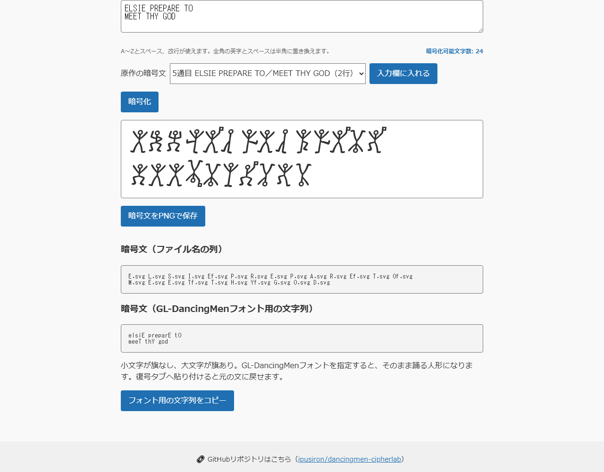
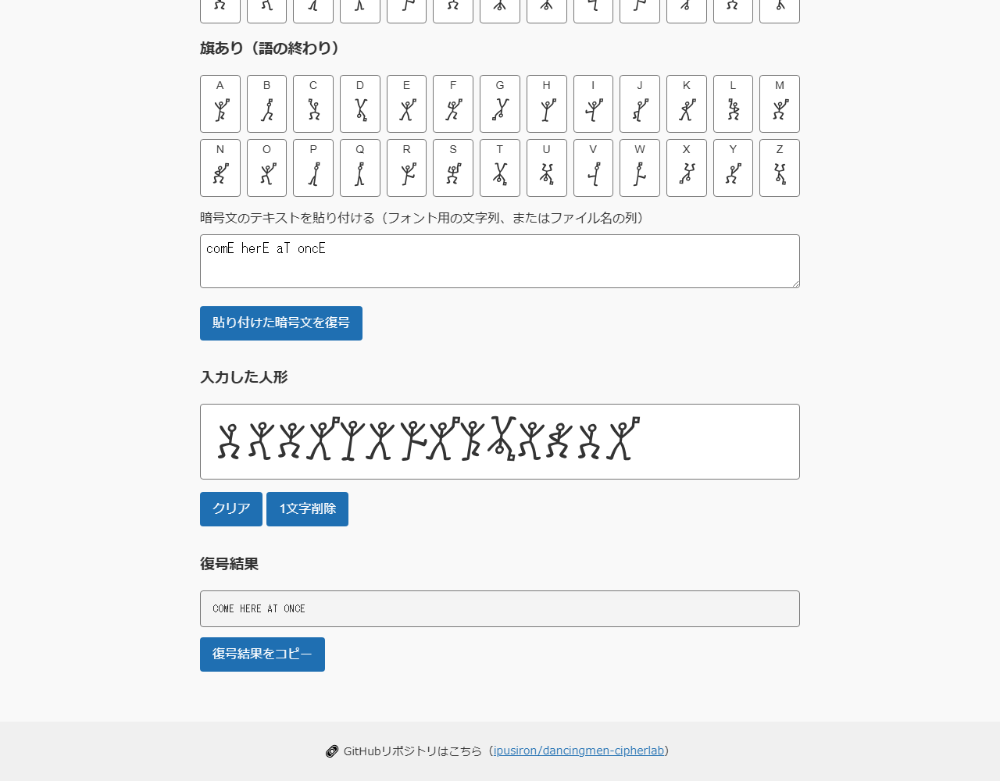
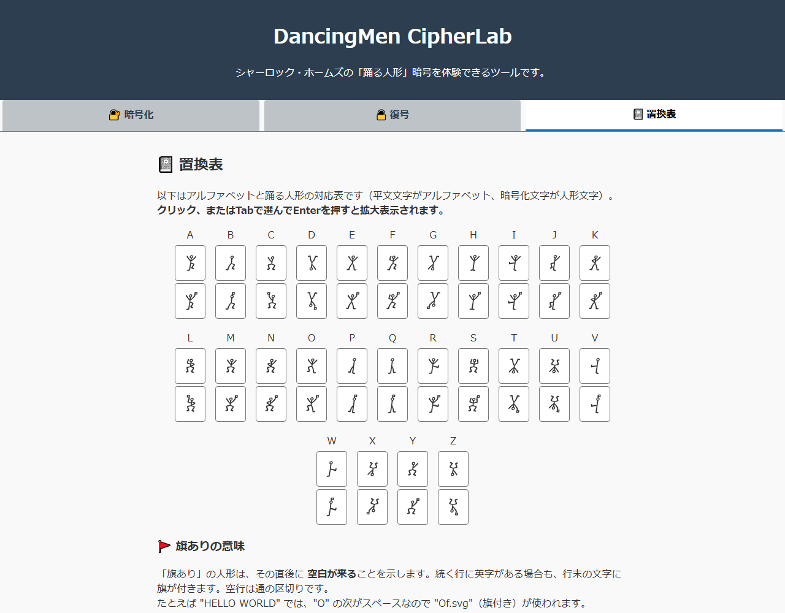
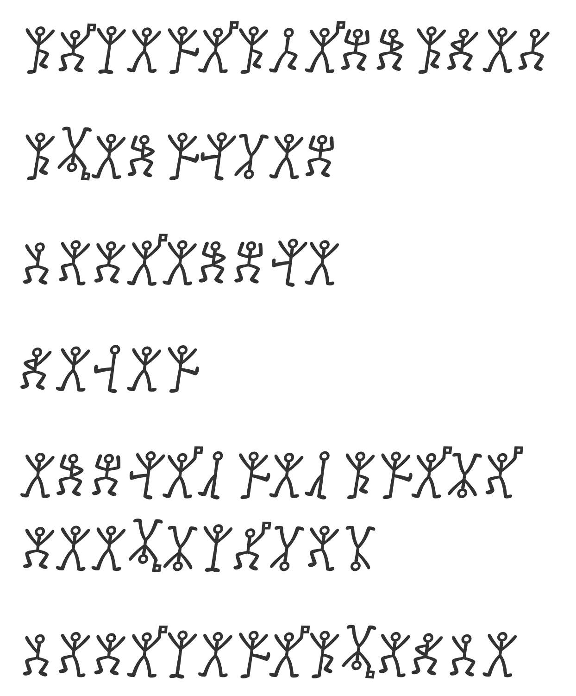

English · [日本語](README.md)

# DancingMen CipherLab - a Dancing Men cipher tool


[](https://ipusiron.github.io/dancingmen-cipherlab/)

**Day022 - Security Tools 100 with Generative AI**

**DancingMen CipherLab** reproduces the cipher from *"The Adventure of the Dancing Men"*, the Sherlock Holmes
story by Arthur Conan Doyle.
Type a message and watch it turn into stick figures, rebuild a message by picking figures one at a time, and
look up the whole substitution table.
The six ciphertexts from the original story are included as samples.

---

## 🌐 Demo

👉 [https://ipusiron.github.io/dancingmen-cipherlab/](https://ipusiron.github.io/dancingmen-cipherlab/)

The page opens in Japanese or English depending on the browser setting, and the button in the top-right corner
switches between them at any time. `?lang=en` and `?lang=ja` force a language.

---

## 📸 Screenshots



> *The fifth message of the story, entered on two lines. The O that ends the first line also carries a flag.*



> *The font string "comE herE aT oncE" pasted in and turned back into "COME HERE AT ONCE".*



> *Every letter from A to Z, without a flag and with one. Each figure enlarges by mouse or by keyboard.*

---

## ✨ Features

### Encrypt tab

- Letters A-Z become the matching dancing man as you type
- A space is carried by the preceding figure as a flag (`A` + space = `Af.svg`)
- Full-width letters, full-width spaces and tabs are folded to half-width, and IME input is handled after it is committed
- Seven samples: the six messages of the original story, plus all of them at once
- Two notations are produced: a list of file names, and a string for the GL-DancingMen font (the latter can be copied)
- Over HTTP the ciphertext can be saved as a PNG (not available over `file://`)

### Decrypt tab

- Click the figures in order, or select them with Tab and press Enter, to rebuild the plaintext
- A flagged figure ends a word, and no trailing space is left at the end of a line
- A font string or a list of file names can be pasted in and decrypted in one go
- The plaintext grows as you go, and single letters or the whole line can be removed

### Substitution table tab

- All 26 letters with both variants, flagged and unflagged
- Any figure enlarges in a native modal dialog, and focus returns to the button that opened it

### Everything else

- Japanese and English interface, switchable in one click and remembered for the next visit
- Responsive layout, usable on a phone
- Runs entirely in the browser: no build step, no external API, no analytics
- Tabs, decrypt buttons and the enlarged view are reachable with the keyboard alone

---

## 📖 How to use

Everything happens on the [demo page](https://ipusiron.github.io/dancingmen-cipherlab/); nothing has to be installed.

### Encrypting

1. Open the **Encrypt** tab.
2. Type a message (a-z, A-Z, spaces and line breaks). Full-width letters and spaces are folded to half-width.
3. The figures appear as you type. The **Encrypt** button does the same thing.
4. To try the original messages, pick one from the list and press **Put it in the input box**.
5. Copy the font string, or press **Save the ciphertext as a PNG** when the page is served over HTTP.

The input is limited to 2,000 characters.
A note about removed or converted characters stays until the next edit that needs no correction.

### Decrypting

1. Open the **Decrypt** tab.
2. Click the figures in the order they appear in the ciphertext, or select them with Tab and press Enter.
3. The figures and the plaintext are appended below.
4. To decrypt from text, paste a font string or a list of file names and press **Decrypt the pasted ciphertext**.
5. **Delete one letter** removes the last figure, **Clear** resets both the figures and the paste box.

In a font string, lower case means no flag and upper case means a flag.
A space alone does not separate words, so `am here` decrypts to `AMHERE` while `aM here` decrypts to `AM HERE`.

### Reading the table

1. Open the **Substitution table** tab.
2. Compare each letter with its two figures.
3. Click a figure, or select it with Tab and press Enter, to see it enlarged.
4. Esc or **Close** dismisses the dialog and returns focus to the button that opened it.

While a tab has focus, the arrow keys move to the neighbouring tab and Home/End jump to the first or last one.
The figures shown in the Encrypt tab are not clickable.

---

## 🚩 The flag rule

A flag marks the end of a word.
The input is normalised first, and then two rules decide where flags go.

1. A letter followed by a space carries a flag.
2. A letter at the end of a line carries a flag when the next line still contains at least one letter.

A blank line, or a line of spaces, separates one message from the next; rule 2 does not reach across it.
Without a trailing space, the last letter of a message carries no flag.
In the table, `⏎` is a line break and `␣` is a space.

| Input | Font string | Why |
|---|---|---|
| HELLO WORLD | hellO world | The last letter of a word takes the flag |
| HELLO　WORLD | hellO world | A full-width space becomes a half-width one first |
| MEET ME⏎AT NOON | meeT mE⏎aT noon | A line that continues also flags its last word |
| HELLO⏎⏎WORLD | hello⏎⏎world | A blank line starts a new message, whose last word takes no flag |
| COME HERE AT ONCE␣ | comE herE aT oncE | A trailing space flags the very last letter |

In [the original text (Project Gutenberg #108)](https://www.gutenberg.org/ebooks/108) the flags are taken to
divide a sentence into words, and a ciphertext without any flag is read as a single word.

---

## 🏗️ Architecture

### Stack

- **Front end**: plain HTML5, CSS3 and vanilla JavaScript
- **Build**: none; the repository is the deployed site
- **Dependencies**: none
- **Hosting**: GitHub Pages

### Design rules

1. **Simplicity**: no build pipeline and no third-party library.
2. **Reach**: anyone can clone it and open it.
3. **Maintainability**: little code, arranged so that each file has one job.

### How the parts divide

- `dancingmen-logic.js` holds the cipher itself and knows nothing about the page
- `dancingmen-messages.js` holds every phrase, in Japanese and in English, under the same keys
- `i18n.js` picks the language, applies it to `data-i18n` markup and remembers the choice
- `script.js` handles input, tabs, drawing, the PNG export and the dialog
- A space is drawn as a flag on the preceding figure, which keeps the row of figures visually continuous
- Three SVG variants exist: full (display and PNG), padded (table and buttons) and tight (the source of full)

---

## 🖋 About the font

The figures come from the **GL-DancingMen** font published by
[Gutenberg Labo](https://github.com/Gutenberg-Labo/GL-DancingMen) (the file is `GL-DancingMen.ttf`).
Each glyph was rendered to its own SVG file, which is what the page displays.

Only six short ciphertexts appear in the story, so the letters F, J, K, Q, U, W, X and Z never show up in it.
The figures for those eight letters are original designs by the font's author.

To try the font itself, [fontspace](https://www.fontspace.com/gl-dancingmen-font-f12468) serves it directly:
lower case gives an unflagged figure, upper case a flagged one, and a space stays a space.

### The three SVG variants

| Variant | What it is | Used for |
|---|---|---|
| **full** | The tight variant with the viewBox widened by 5pt left and right and 2pt top and bottom | Rows of figures, and the PNG export |
| **tight** | The most closely cropped variant, generated with `bbox_inches='tight'` | The source the full variant is built from |
| **padded** | The first generation, 72x72pt with generous margins | Looking up or comparing a single letter |

Both the padded and the tight files were produced from the TTF with Python and Matplotlib: the padded ones
centred in a 1x1 inch figure at 48 dpi, the tight ones anchored to the top-left in a 0.4x0.4 inch figure at
120 dpi with `pad_inches=0`.

---

## 🔧 Implementation notes

`sanitizeInput` normalises the text, `encryptText` turns it into rows of `{ letter, flag }` tokens, and
`toFileNameText` and `toFontText` render those rows in the two notations.
`parseCipherText` and `decodeTokens` take either notation back to plaintext.

The tight SVGs let the flag stick out of the `viewBox` (up to 3.8pt to the right and 1.49pt upwards), so the
full variant widens the box and the figures are laid out at their intrinsic size.
A negative margin of -5pt brings the spacing back to the font's own advance width of 38.4px, and
`mix-blend-mode: multiply` drops the white background.

The PNG export measures the rows with `layoutCipher` and draws the same full SVGs onto a canvas at twice the
scale. Anything wider or taller than 8,000px is refused.
`node tools/build-full-svg.js` regenerates the full variant, and `--check` compares without writing.

Every phrase the page shows is looked up by key, so a language switch redraws the figures' alternative text,
the substitution table, the sample list and the status messages together.

---

## 🎯 Use cases

### Ways of using this tool in particular

- Confirming that it is a simple substitution despite the figures (frequency-analysis classes): each letter maps to one dancing figure. Encrypting HELLO makes the same "L" the same figure twice, so repeated letters appear as repeated figures. Behind the exotic look it is a simple substitution, and you can confirm that counting the figures lets frequency analysis work
- Confirming that a flag marks word boundaries and leaks word lengths (cryptanalysis classes): the last figure of each word carries a flag. Encrypting HELLO WORLD raises a flag on the O at the end of the first word (the 5th letter). You can confirm that showing word breaks with a flag leaks the clue of word length and helps decryption (the same idea by which Sherlock Holmes started from short words)
- Confirming that all 26 letters map one to one to figures (substitution classes): each of the 26 letters of the alphabet is assigned one fixed figure. Since letters and figures are one to one, you can always turn a figure back into its letter. Behind the pictures it is a fixed substitution table with no key

### General uses

- Learn how the Dancing Men cipher (Sherlock Holmes) works in class or self-study
- Make figure ciphertext (SVG or image) to hand out at puzzles and events
- Use it as a subject for frequency analysis of a simple substitution cipher

## 🔒 Security and privacy

- A meta CSP allows scripts, styles and images from the same origin only. No inline handler and no `style` attribute is used
- The referrer is set to `no-referrer`, and links that open a new tab carry `rel="noopener noreferrer"`
- Input is normalised and length-limited, and everything is written through `textContent`
- No external API, CDN or analytics: displaying and using the page causes no outbound request
- When the clipboard API is unavailable or denied, the page explains how to copy by hand
- Nothing you type leaves the browser. The only thing stored locally is the chosen language

Two limits are worth stating. Following an external link does talk to that site, and a meta CSP cannot stop
clickjacking, because HTTP response headers such as `X-Frame-Options` cannot be set from static files on
GitHub Pages.

---

## 🧪 Tests

Node.js 22 or later, from the repository root. There is nothing to install.

```bash
npm test
node tools/build-full-svg.js --check
```

GitHub Actions runs `npm test` on every push and pull request.
The suite covers the flag rule, normalisation, round trips between the two notations, figure dimensions, PNG
layout, colour contrast, the HTML, both dictionaries and the tables in this file.
It also verifies with SHA-256 that the 104 original SVGs are untouched and that the 52 full SVGs still match
what the build script produces.

---

## 🔎 Exploring the Dancing Men

*"The Adventure of the Dancing Men"* is collected in *The Return of Sherlock Holmes*.
Six ciphertexts appear in it, and this tool can generate all of them.

| No. | Plaintext | Font string (lower case = no flag, upper case = flag) |
|---|---|---|
| 1 | AM HERE ABE SLANEY | aM herE abE slaney |
| 2 | AT ELRIGES | aT elriges |
| 3 | COME ELSIE | comE elsie |
| 4 | NEVER | never |
| 5 | ELSIE PREPARE TO⏎MEET THY GOD | elsiE preparE tO⏎meeT thY god |
| 6 | COME HERE AT ONCE | comE herE aT once |

Messages 1 to 5 agree with the notation listed in the
[ReadMe of GL-DancingMen-Org](https://github.com/Gutenberg-Labo/GL-DancingMen/blob/main/documents/GL-DancingMen-Org-readme.txt),
the font drawn after the original illustrations.
The fifth message occupies two lines in the book, and the O that ends its first line carries a flag.
The sixth is the one exception: the ReadMe gives `comE herE aT oncE`, with a flag on the final E as well.
To reproduce that here, add one trailing space to the input. The bundled sample has no trailing space.



> *All six messages, exported as a PNG by this tool. Blank lines separate them; only the fifth takes two lines.*

The cipher is a simple monoalphabetic substitution, which is why frequency analysis works on it. Holmes
guesses that the most frequent figure is E: four of the fifteen figures in the first message are the same one.
He then works out that the flags mark word boundaries.

For frequency analysis it helps to replace the figures with ordinary letters first, which is true of any
substitution cipher written in pictograms.

👉 [Frequency Analyzer](https://github.com/ipusiron/frequency-analyzer)

---

## 📁 Directory structure

```text
dancingmen-cipherlab/                  # A web tool for the Dancing Men cipher
├── .github/                           # GitHub configuration
│   └── workflows/                     # GitHub Actions workflows
│       └── test.yml                   # Runs npm test on push and pull request
├── .gitignore                         # Paths kept out of version control
├── .nojekyll                          # Disables Jekyll processing on Pages
├── assets/                            # Figure SVGs and the images in the READMEs
│   ├── dancingmen_messages.png        # The six original messages, exported by this tool
│   ├── screenshot.png                 # Encrypt tab, with the fifth message on two lines
│   ├── screenshot2.png                # Decrypt tab, decrypting a pasted font string
│   ├── screenshot3.png                # Substitution table tab
│   └── svg/                           # Figures generated from the GL-DancingMen font
│       ├── full/                      # 52 files widened by 5pt/2pt, for rows and PNGs
│       ├── padded/                    # 52 files at 72x72pt, for the table and buttons
│       └── tight/                     # 52 closely cropped files, the source of full
├── CLAUDE.md                          # Development guide for AI assistants
├── dancingmen-logic.js                # The cipher itself, independent of the page
├── dancingmen-messages.js             # Japanese and English phrases, and the formatter
├── i18n.js                            # Language choice and data-i18n application
├── index.html                         # The three tabs
├── LICENSE                            # MIT license of this tool
├── package.json                       # npm test, with no dependencies
├── README.en.md                       # This document
├── README.md                          # The Japanese document
├── script.js                          # Input, tabs, drawing, PNG export, dialog
├── style.css                          # Colour variables and the responsive layout
├── test/                              # Automated tests for node --test
│   ├── assets.test.js                 # Names, sizes and integrity of the 156 SVGs
│   ├── contrast.test.js               # Contrast of text against every surface
│   ├── format.test.js                 # Line length and source size
│   ├── html.test.js                   # CSP, ARIA and the absence of inline code
│   ├── i18n.test.js                   # Dictionaries, data-i18n keys and the switch
│   ├── layout.test.js                 # Figure dimensions, viewBox widening, PNG layout
│   ├── logic.test.js                  # Normalisation, flags, notations, round trips
│   ├── messages.test.js               # The dictionary and the keys the page asks for
│   ├── readme.test.js                 # Tables, images, tree and metadata
│   ├── samples.test.js                # The known answers of the six messages
│   └── static.test.js                 # Purity, forbidden constructs and the CI setup
└── tools/                             # Development scripts, unused by the page
    └── build-full-svg.js              # Builds full from tight; --check only compares
```

---

## 💻 Requirements

Static HTML, CSS and JavaScript, with no build step.
Encrypting, decrypting, the table and copying were checked on Chromium 145 on Windows, over HTTP and over
`file://`. Copying depends on the browser's permission settings; when it is refused, the page says so.
Firefox and Safari are untested.

A local clone can be opened directly, except for the PNG export, which needs HTTP.

```bash
git clone https://github.com/ipusiron/dancingmen-cipherlab.git
cd dancingmen-cipherlab
python -m http.server 8000 --bind 127.0.0.1
```

Then open `http://127.0.0.1:8000/`.
Served that way, "COME HERE AT ONCE" exports as 1166x198 and all six messages as 1244x1502.

---

## 📄 License

MIT License. See [LICENSE](LICENSE) for the full text.

The figures were generated from the
[GL-DancingMen font](https://github.com/Gutenberg-Labo/GL-DancingMen)
(Copyright (C) 2007-2009 Das Ende der Wildnis, Copyright (C) 2008-2023 Gutenberg Labo).
That font may be used, copied and redistributed freely, modified or not, for any purpose, without warranty.
See the font's [LICENSE.txt](https://github.com/Gutenberg-Labo/GL-DancingMen/blob/main/LICENSE.txt).

---

## 🛠️ About this project

This tool is part of **Security Tools 100 with Generative AI**, a series in which one security-related tool is
built and published each day with the help of generative AI.

🔗 [https://akademeia.info/?page_id=42163](https://akademeia.info/?page_id=42163)
