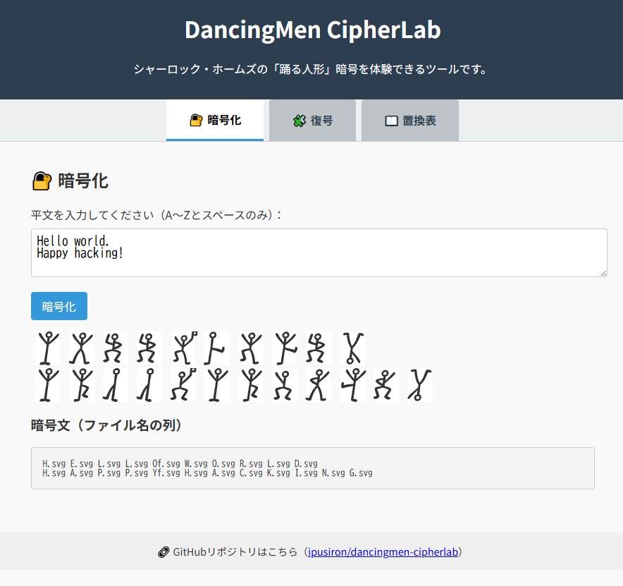
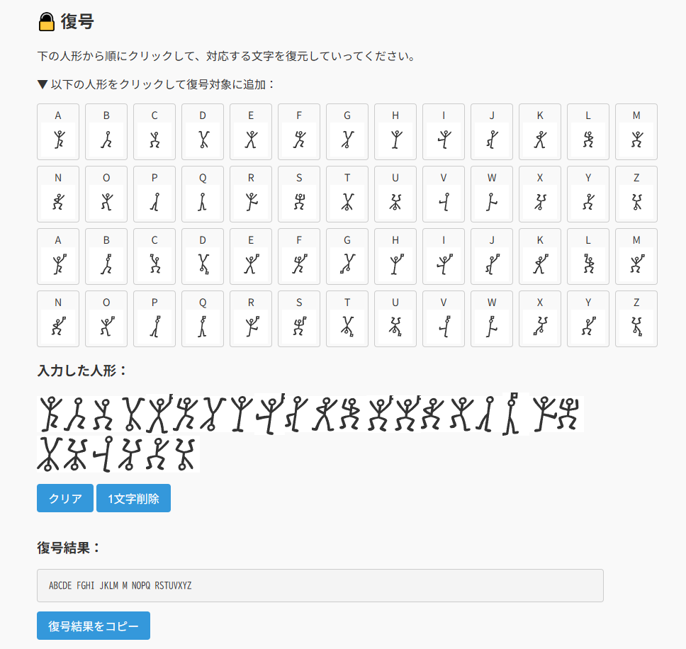
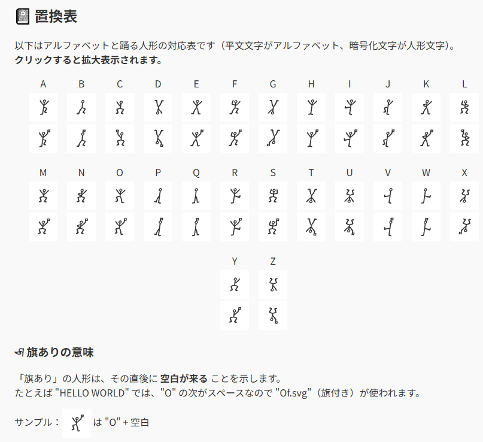
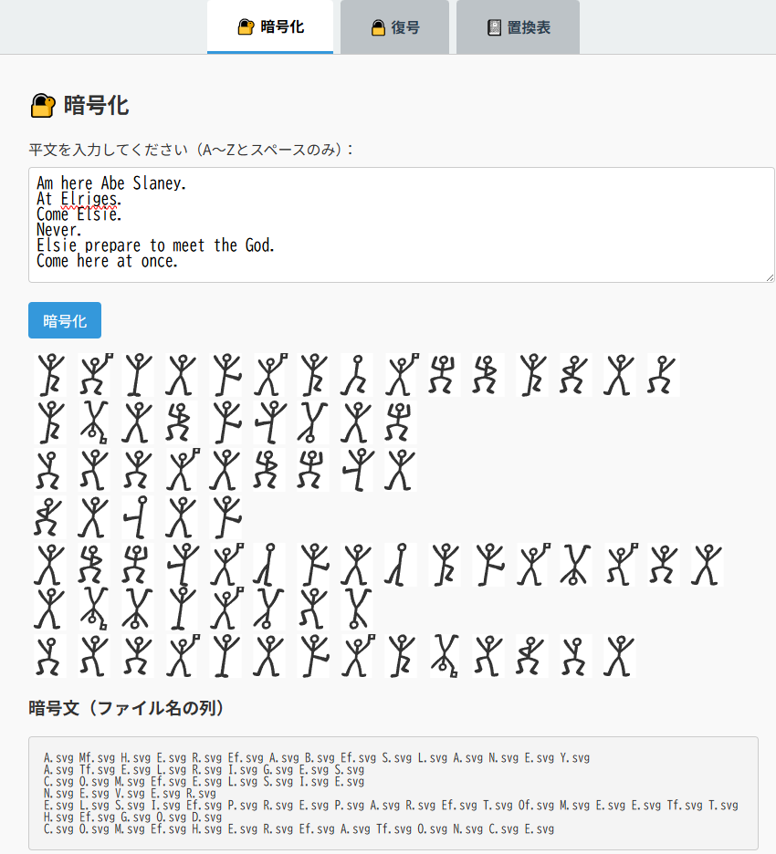

# DancingMen CipherLab - ドイルの踊る人形暗号ツール


**Day022 - 生成AIで作るセキュリティツール100**

**DancingMen CipherLab** は、シャーロック・ホームズの短編「踊る人形」に登場する古典暗号を再現・体験できるWebツールです。
英文を入力すると、それぞれの文字が踊る人形の図形に変換されて暗号文が生成されます。

本ツールでは、以下のような特徴を備えています：

- ✍️ **平文を入力すると自動で暗号化**
- 👣 **「旗付き人形」による空白表現**
- 🖼 **視覚的に並ぶ人形で暗号の雰囲気を体感**
- 🔁 **復号支援機能にも対応**

本ツールは、古典暗号・推理小説・ビジュアル表現に興味をもつ初学者から研究者まで、幅広いユーザーを想定しています。
学習・教育・創作支援など多様な用途に活用可能です。
古典暗号やシャーロキアンに興味のある方、遊びながら暗号を学びたい方にもおすすめのツールです。

---

## 🌐 デモページ

👉 [https://ipusiron.github.io/dancingmen-cipherlab/](https://ipusiron.github.io/dancingmen-cipherlab/)

---

## 📸 スクリーンショット

>
>*暗号化の例*
>
>
>*復号の例*
>
>
>*置換表（平文文字がアルファベット、暗号文文字が人形文字）*


---
## 🔍 本ツールの主な機能

- 「暗号化」タブでは、アルファベットを入力すると、自動的に対応する「踊る人形」画像に変換し、暗号文を生成する。
- 「復号」タブでは、人形を順にクリックすることで対応する文字を得る支援する。
- 「置換表」タブでは、アルファベットとその対応する人形画像の一覧を参照できる。

※現時点では、復号タブでは1文字ずつの対応しか支援しておらず、全文自動復号機能は未実装です。

---
## 📁 ディレクトリ構成

```
dancingmen-cipherlab/
├── index.html  # メインUI（暗号化・復号・置換表）
├── script.js   # 暗号化／復号処理とUI制御
├── style.css   # 各UI要素のスタイリング
├── assets/
│ ├── svg/
│ │ ├── tight/  # tight版SVG素材
│ │ └── padded/ # padded版SVG素材（余白あり）
│ └── *.png     # スクリーンショット用画像
└── README.md   # 本ファイル
```

---
## 📖 使い方

[デモページ](https://ipusiron.github.io/dancingmen-cip)にアクセスするだけで利用可能です。

1. 「暗号化」タブを開き、英語の平文を入力すると、自動で人形暗号が表示されます。
2. 「復号」タブでは、SVG人形を順番にクリックして復号文字列を構成します。
3. 「置換表」タブで、人形とアルファベットの対応を確認できます。

### ローカル利用

本ツールはHTML + JavaScriptのみで構成されており、ローカル環境でそのまま動作します。ビルドや外部依存は不要です。

---
## 🖋 使用フォントについて

本ツールで使用している踊る人形のSVG素材は、[Gutenberg Labo / GL-DancingMen](https://github.com/Gutenberg-Labo/GL-DancingMen) にて公開されている **GL-DancingMen** フォント（ファイルは`GL-DancingMen.ttf`）を基に生成しています。

> 自由に利用・複製OKということで、ありがたく使わせていただきました。

このフォントを利用させていただき、1文字ずつSVG化することで、視覚的に踊る人形暗号を再現しています。

---
### GL-DancingMenフォントの詳細

本編中には5つの暗号文が登場します。
いずれも比較的短い暗号文であるため、'F'、'J'、'K'、'Q'、'U'、'W'、'X'、'Z'に対応する人形文字が登場しません。
そのため、これらの文字はオリジナルでデザインを採用しているとのことです。

なお、GL-DancingMenフォントをテストしたい場合は、[https://www.fontspace.com/gl-dancingmen-font-f12468](https://www.fontspace.com/gl-dancingmen-font-f12468)が有効です。
小文字が旗なし、大文字が旗あり、空白はそのまま空白に対応しています。

---
### 🧷 SVG素材のバリエーションについて（padded版とtight版）

本ツールでは、表示される「踊る人形」のSVG素材について、以下の2種類を用意しています：

| バージョン | 説明 |
|------------|------|
| **padded版** | 初期生成版。余白（padding）が多めに含まれており、ゆったりとした見た目です。比較・デザイン検証用途に向いています。 |
| **tight版**  | 余白を極限まで除去した正式版。`bbox_inches='tight'` に加え、左上基準配置やfigsize最小化などを組み合わせ、**人形同士の間隔がもっとも詰まった表示** になります。 |

---
### 🛠 TTFファイルからSVGファイルを生成する技術的解説

padded版SVGファイルとtight版SVGファイルを具体的にどう生成したのかを解説します。

#### padded版SVGの生成方法について

`assets/svg/padded/`以下に格納されているSVG素材は、`GL-DancingMen.ttf`の各文字をPython + Matplotlibを用いて以下の条件で生成したものです：

- **描画方式**：`matplotlib.pyplot.text()` により人形文字を描画
- **位置指定**：`x=0.5`, `y=0.5`, `ha='center'`, `va='center'`（中央寄せで描画）
- **出力設定**：
  - `figsize=(1, 1)`
  - `dpi=48`
  - `bbox_inches` の指定なし（デフォルト）
- **出力形式**：`A.svg` ～ `Z.svg`、および `Af.svg` ～ `Zf.svg`

このバージョンでは描画領域全体に対して人形文字が中央に配置されており、**周囲に比較的広めの余白が含まれる**のが特徴です。

表示のゆとりや比較用の素材として利用することを想定しています。

---
#### tight版SVGの生成方法について

デフォルトで使用されているSVG素材（`assets/svg/tight/` 以下）は、`GL-DancingMen.ttf`の各文字をベースにPython + Matplotlibによって以下の条件で自動生成したものです：

- **描画方式**：`matplotlib.pyplot.text()` により人形文字を描画
- **位置指定**：`x=0`, `y=1`, `ha='left'`, `va='top'`（左上に寄せて描画）
- **出力調整**：
  - `figsize=(0.4, 0.4)`
  - `dpi=120`
  - `bbox_inches='tight'` + `pad_inches=0` を指定し、**余白を極限まで除去**
- **出力形式**：1文字ごとに `A.svg` 〜 `Z.svg`（旗なし）、および `Af.svg` 〜 `Zf.svg`（旗あり）として保存

これにより、**人形同士の表示間隔が最小限となるtight版SVG**が実現されています。

---
## 「踊る人形」を探究する

「踊る人形」（原題 *"The Dancing Men"*）は、アーサー・コナン・ドイルの短編集『シャーロック・ホームズの帰還』に収録されています。

踊る人形では以下の5つの暗号文が登場します。

> 最初の暗号文（依頼者であるヒルトン・キュビットがホームズに最初に見せた暗号文）
> > "Am here Abe Slaney."
> > 「私はここにいる。エイブ・スレーニー」
> 
> 2つ目の暗号文（2週間後にまた描かれていた暗号文）
> > "At Elriges. Come Elsie."
> >「エルリッジに。こい、エルシー」
>
> 3つ目の暗号文（犯人ではなく依頼者の妻エルシーが描いた暗号文）
> > "Never."
> >「決して」
>
> 4つ目の暗号文（ヒルトン・キュビットがホームズと別れた2日後に描かれた暗号文）
> > "Elsei prepare to meet the God."
> >「エルシー、神に会う準備はできたか」
>
> 5つ目の暗号文（ホームズが犯人をおびき出すために描いた暗号文）
> > "Come here at once."
> >「すぐ来て」

本ツールを使えば、この5つの暗号文も生成できます。

>
>*「踊る人形」に登場する暗号文*

---
### 踊る人形の暗号は単一換字式暗号

シンプルな単一換字式暗号であるため、頻度分析のアプローチが有効です。

「踊る人形」の中で、ホームズは頻度分析の知識を活用して、一番多く登場する人形文字が'E'であると推測しました。
その後、旗は文字の区切りを意味することも突き止めます。
さらに推論を働かせて、暗号文を解読し、最終的に犯人に暗号文を送るに至るわけです。

もし頻度分析するとしても、人形文字のままだと処理しにくいため、適当にアルファベットに置き換えるとよいでしょう（このアプローチは他の表意文字を使った単一換字式暗号文にも有効）。
そのあとで頻度分析すれば、平文文字と暗号文文字の対応を推測できます。

👉 [頻度分析ツール（Frequency Analyzer）](https://github.com/ipusiron/frequency-analyzer)

---
### 似たような暗号

『暗号の秘密』（P.63）によると、ドイルの「踊る人形」より先に、ニコラスの踊る人形があったといいます。
ドイルが真似たわけではないが、時と場所の違いにもかかわらず人間はよく似たものを考えつく証拠ともいえます。

---
### 「踊る人形」の参考資料

参考資料は多数あるので、私がピックアップしたものだけになります。
随時更新する予定です。

---
#### Webリソース

- [Wikipedia 踊る人形](https://ja.wikipedia.org/wiki/%E8%B8%8A%E3%82%8B%E4%BA%BA%E5%BD%A2)
- [GL-DancingMen](https://github.com/Gutenberg-Labo/GL-DancingMen)
- [踊る人形の暗号の挿絵と意味](https://rivoli-antiques.com/dancingmen/) 

---
#### 書籍

-『暗号解読事典』 P145 シャーロック・ホームズの『踊る人形』のサイファ
-『暗号の話』P186 第9章 推理小説と暗号

---
## 📄 ライセンス

MIT License - 詳細は[LICENSE](LICENSE)をご覧ください。

---
## 🛠 このツールについて

本ツールは、「生成AIで作るセキュリティツール100」プロジェクトの一環として開発されました。 このプロジェクトでは、AIの支援を活用しながら、セキュリティに関連するさまざまなツールを100日間にわたり制作・公開していく取り組みを行っています。

プロジェクトの詳細や他のツールについては、以下のページをご覧ください。

🔗 [https://akademeia.info/?page_id=42163](https://akademeia.info/?page_id=42163)
