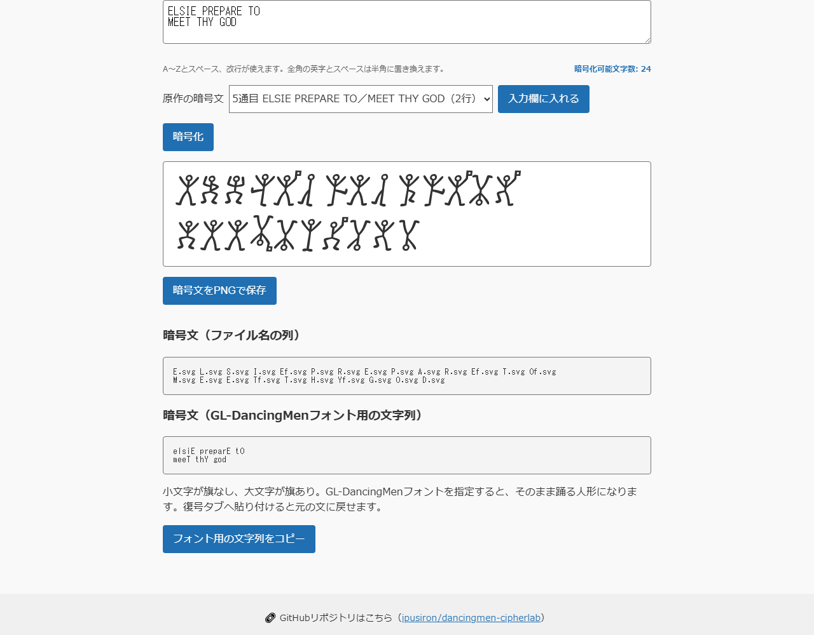
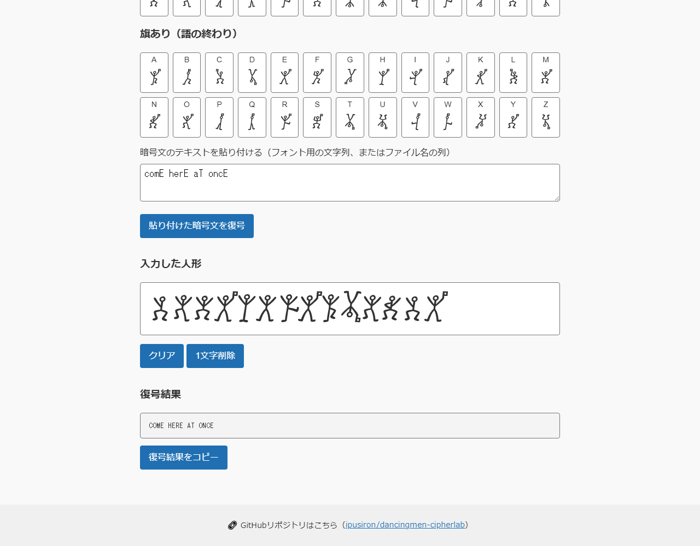
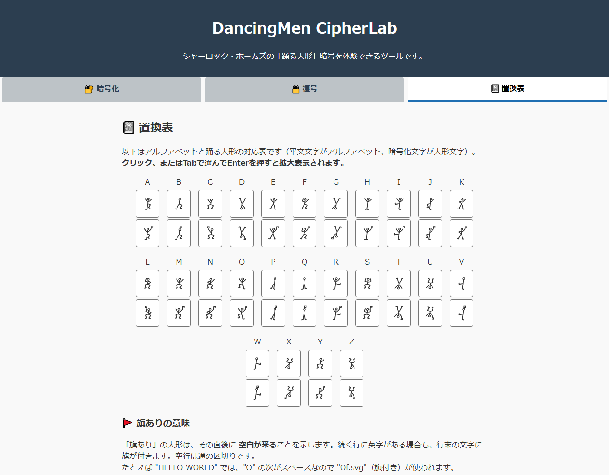
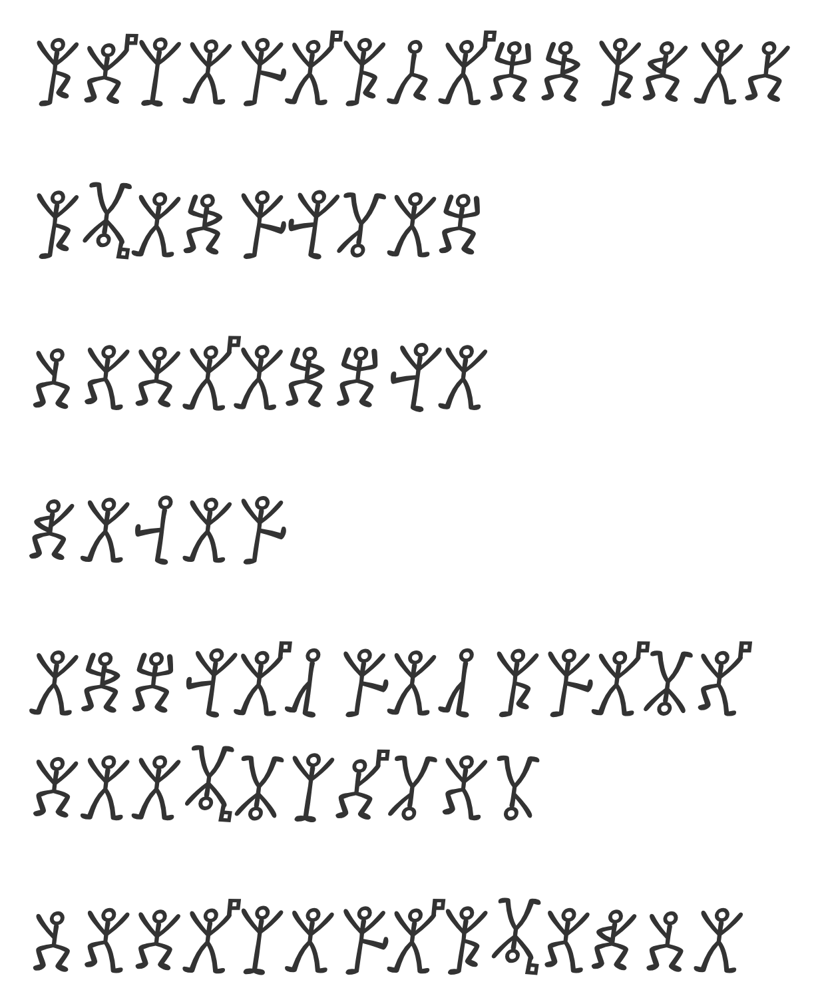

<!--
---
id: day022
slug: dancingmen-cipherlab

title: "DancingMen CipherLab"

subtitle_ja: "ドイルの踊る人形暗号ツール"
subtitle_en: "Sherlock Holmes Dancing Men Cipher Tool"

description_ja: "シャーロック・ホームズの短編「踊る人形」に登場する古典暗号を再現・体験できるWebツール。平文の暗号化、復号支援、置換表の参照が可能。"
description_en: "A web tool to experience the classical substitution cipher from Arthur Conan Doyle's Sherlock Holmes story 'The Dancing Men'. Supports encryption, decryption assistance, and substitution table reference."

category_ja:
  - 古典暗号
  - 換字式暗号
category_en:
  - Classical Cryptography
  - Substitution Cipher

difficulty: 1

tags:
  - sherlock-holmes
  - dancing-men
  - cryptography
  - visualization

repo_url: "https://github.com/ipusiron/dancingmen-cipherlab"
demo_url: "https://ipusiron.github.io/dancingmen-cipherlab/"

hub: true
---
-->

# DancingMen CipherLab - ドイルの踊る人形暗号ツール


[](https://ipusiron.github.io/dancingmen-cipherlab/)

**Day022 - 生成AIで作るセキュリティツール100**

**DancingMen CipherLab**は、シャーロック・ホームズの短編「踊る人形」に登場する古典暗号を再現・体験できるWebツールです。
平文を人形へ暗号化し、人形の選択や暗号文の貼り付けで復号でき、原作6通のサンプルも試せます。
古典暗号や推理小説に興味のある初学者から研究者まで、学習・教育・創作支援に利用できます。

---

## 🌐 デモページ

👉 [https://ipusiron.github.io/dancingmen-cipherlab/](https://ipusiron.github.io/dancingmen-cipherlab/)

---

## 📸 スクリーンショット



> *原作の5通目を2行で入力。1行目末尾のOにも旗が付き、ファイル名とフォント用の文字列を出力*



> *フォント用の文字列「comE herE aT oncE」を貼り付けて「COME HERE AT ONCE」へ復号*



> *A〜Zの旗なし・旗ありの置換表。ボタンはクリックとキーボードの両方で拡大可能*

---
## ✨ 主な機能

### 暗号化タブ

- アルファベット（A-Z）の英文を入力すると、自動的に対応する「踊る人形」画像に変換
- 空白文字は「旗付き人形」として表現（例：`A` + 空白 = `Af.svg`）
- リアルタイムで暗号化処理を実行
- 全角英字・全角スペース・タブを半角へ置き換え、IMEの変換確定後に処理
- 原作6通と「6通すべて」の7種類のサンプル
- ファイル名の列とGL-DancingMenフォント用の文字列を出力し、後者をコピー可能
- HTTP配信時は暗号文をPNGで保存可能（file://では保存不可）

### 復号タブ  

- 人形画像を順番にクリックして復号文字列を構築
- 旗付き人形を語の終わりとして認識し、結果の行末には空白を残さない
- フォント用の文字列とファイル名の列を貼り付けて復号可能
- 復号中の文字列をリアルタイムで表示
- クリアボタンで復号文字列をリセット可能

### 置換表タブ

- A-Zまでのアルファベットと対応する人形画像を一覧表示
- 各文字の旗なし版・旗付き版の両方を参照可能
- 画像クリックでモーダル拡大表示機能

### その他の機能

- レスポンシブデザイン対応
- 日本語UI（シャーロキアン向け）
- 純粋なクライアントサイド実装（外部API不要）
- タブ・復号ボタン・置換表の拡大をキーボードだけで操作可能

---
## 📖 使い方

[デモページ](https://ipusiron.github.io/dancingmen-cipherlab/)にアクセスするだけで利用可能です。

### 暗号化の手順

1. 「暗号化」タブを開く
2. テキストエリアに英文（a-z、A-Z、スペース、改行）を入力。全角英字と空白類は半角へ置換
3. 入力と同時に下部に踊る人形の暗号文が自動生成される。「暗号化」ボタンでも実行可能
4. 原作の例はサンプルを選び、「入力欄に入れる」を押す
5. フォント用の文字列をコピーするか、HTTP配信時は「暗号文をPNGで保存」を押す

入力の上限は2,000文字です。
変換・削除のメッセージは次の入力処理まで残り、修正の不要な入力を行うと消えます。

### 復号の手順

1. 「復号」タブを開く
2. 表示される人形一覧から、復号したい順番でクリックするか、Tabで選んでEnterを押す
3. 選んだ人形と復号結果が下部に追加される
4. テキストから復号する場合は、フォント用の文字列かファイル名の列を貼り付け、「貼り付けた暗号文を復号」を押す
5. 「1文字削除」で末尾を削除、「クリア」で状態と貼り付け欄をリセット。「復号結果をコピー」でコピー可能

フォント用の文字列は小文字が旗なし、大文字が旗ありです。
空白だけでは語を区切らないため、`am here`は`AMHERE`、`aM here`は`AM HERE`に復号されます。

### 置換表の確認

1. 「置換表」タブを開く
2. A-Zの各文字と対応する人形（旗なし・旗付き）を確認
3. 画像クリック、またはTabで選択してEnterを押すと拡大表示
4. Escか「閉じる」で閉じると、開いたボタンへフォーカスが戻る

タブにフォーカスがあるときは←→で隣へ、Home／Endで最初／最後のタブへ移動できます。
暗号化タブの人形は拡大操作の対象ではありません。

---
## 🚩 旗の規則

旗は語の区切りを表します。
まず全角英字・空白類を正規化し、次の2つの規則で旗を付けます。

1. 文字の直後が半角スペースなら旗あり
2. 文字が行の最後にあり、すぐ次の行に英字が1つ以上あれば旗あり

空行や空白だけの行は通の区切りです。
その直前の行には規則2を適用しません。
末尾スペースがなければ、各通の最後の文字は旗なしになります。
表の`⏎`は改行、`␣`は半角スペースです。

| 入力 | フォント用の文字列 | 説明 |
|---|---|---|
| HELLO WORLD | hellO world | 語の最後の文字に旗が付く |
| HELLO　WORLD | hellO world | 全角スペースは半角に置き換えてから処理する |
| MEET ME⏎AT NOON | meeT mE⏎aT noon | 続きの行があれば、行末の語にも旗が付く |
| HELLO⏎⏎WORLD | hello⏎⏎world | 空行で区切ると別の通になり、各通の最後の語には旗が付かない |
| COME HERE AT ONCE␣ | comE herE aT oncE | 末尾に半角スペースを入れると、最後の文字にも旗が付く |

[原文（Project Gutenberg #108）](https://www.gutenberg.org/ebooks/108)では、旗は文を語に分けるために使われていると推測されています。
また、旗がない暗号文は1語と考えられています。

---
## 🏗️ アーキテクチャ

### 技術スタック

- **フロントエンド**: Pure HTML5 + CSS3 + Vanilla JavaScript
- **ビルドツール**: 不要（静的ファイルのみ）
- **外部依存**: なし
- **ホスティング**: GitHub Pages

### 設計原則

1. **シンプルさ**: ビルドプロセスや外部ライブラリーに依存しない
2. **アクセシビリティ**: 誰でも簡単に利用・展開可能
3. **保守性**: コード量を最小限に抑え、理解しやすい構造を維持

### 実装の特徴

- **空白文字の処理**: 旗付き人形（`Af.svg`〜`Zf.svg`）で表現し、視覚的な連続性を保持
- **SVGの3バージョン管理**: full版（表示・PNG保存用）、padded版（参照・選択用）、tight版（full版の生成元）
- **モーダルシステム**: ネイティブのdialog要素による置換表の画像拡大
- **イベント駆動設計**: 効率的なイベントデリゲーションによるUI制御
- **分離**: 純粋ロジックはdancingmen-logic.js、文言の辞書はdancingmen-messages.js、画面処理はscript.js

---
## 🖋 使用フォントについて

本ツールで使用している踊る人形のSVG素材は、[Gutenberg Labo / GL-DancingMen](https://github.com/Gutenberg-Labo/GL-DancingMen) にて公開されている **GL-DancingMen** フォント（ファイルは`GL-DancingMen.ttf`）を基に生成しています。

> 自由に利用・複製OKということで、ありがたく使わせていただきました。

このフォントを利用させていただき、1文字ずつSVG化することで、視覚的に踊る人形暗号を再現しています。

---
### GL-DancingMenフォントの詳細

本編中には6つの暗号文が登場します。
いずれも比較的短い暗号文であるため、'F'、'J'、'K'、'Q'、'U'、'W'、'X'、'Z'に対応する人形文字が登場しません。
そのため、これらの文字はオリジナルでデザインを採用しているとのことです。

なお、GL-DancingMenフォントをテストしたい場合は、[https://www.fontspace.com/gl-dancingmen-font-f12468](https://www.fontspace.com/gl-dancingmen-font-f12468)が有効です。
小文字が旗なし、大文字が旗あり、空白はそのまま空白に対応しています。

---
### 🧷 SVG素材のバリエーションについて（full版・padded版・tight版）

本ツールでは、表示される「踊る人形」のSVG素材について、以下の3種類を用意しています。

| バージョン | 説明 | 用途 |
|------------|------|------|
| **full版** | tight版のviewBoxを左右5pt・上下2pt拡張。旗のはみ出しを含めた素材 | 暗号文の連続表示・PNG保存 |
| **tight版** | `bbox_inches='tight'`に加え、左上基準配置やfigsize最小化などで余白を最も詰めた既存素材 | full版の生成元 |
| **padded版** | 初期生成版。余白（padding）が多めに含まれており、ゆったりとした見た目です。 | 個別文字の参照・比較用 |

---
### 🛠 TTFファイルからSVGファイルを生成する技術的解説

padded版SVGファイルとtight版SVGファイルを具体的にどう生成したのかを解説します。

#### padded版SVGの生成方法について

`assets/svg/padded/`以下に格納されているSVG素材は、`GL-DancingMen.ttf`の各文字をPython + Matplotlibを用いて以下の条件で生成したものです。

- **描画方式**：`matplotlib.pyplot.text()` により人形文字を描画
- **位置指定**：`x=0.5`, `y=0.5`, `ha='center'`, `va='center'`（中央寄せで描画）
- **出力設定**
  - `figsize=(1, 1)`
  - `dpi=48`
  - `bbox_inches` の指定なし（デフォルト）
- **出力形式**：`A.svg` ～ `Z.svg`、および `Af.svg` ～ `Zf.svg`

このバージョンでは描画領域全体に対して人形文字が中央に配置されており、**周囲に比較的広めの余白が含まれる**のが特徴です。

表示のゆとりや比較用の素材として利用することを想定しています。

---
#### tight版SVGの生成方法について

full版の生成元であるSVG素材（`assets/svg/tight/`以下）は、`GL-DancingMen.ttf`の各文字をベースにPython + Matplotlibによって以下の条件で自動生成したものです。

- **描画方式**：`matplotlib.pyplot.text()` により人形文字を描画
- **位置指定**：`x=0`, `y=1`, `ha='left'`, `va='top'`（左上に寄せて描画）
- **出力調整**
  - `figsize=(0.4, 0.4)`
  - `dpi=120`
  - `bbox_inches='tight'` + `pad_inches=0` を指定し、**余白を極限まで除去**
- **出力形式**：1文字ごとに `A.svg` 〜 `Z.svg`（旗なし）、および `Af.svg` 〜 `Zf.svg`（旗あり）として保存

これにより、**人形同士の表示間隔が最小限となるtight版SVG**が実現されています。

---
## 🔧 技術仕様

### 暗号化アルゴリズム

`dancingmen-logic.js`の`sanitizeInput`で入力を正規化し、`encryptText`で文字と旗の状態を持つトークンの行配列にします。
`toFileNameText`・`toFontText`が表記を変換し、`parseCipherText`・`decodeTokens`が貼り付けと復号を受け持ちます。
旗の規則は前述の「旗の規則」を参照してください。
画面の入力処理はIMEの変換中に値を書き換えず、確定後の置換ではキャレットを戻します。

### ファイル命名規則

- **通常文字**: `[A-Z].svg`（例：`A.svg`, `B.svg`）
- **旗付き文字**: `[A-Z]f.svg`（例：`Af.svg`, `Bf.svg`）
- **合計**: 各版52ファイル（26文字×2状態）、3版で156ファイル

### 人形の表示とPNG保存

tight版のSVGは旗が`viewBox`の外へはみ出しています（右へ最大3.8pt、上へ最大1.49pt）。
そこで`viewBox`を左右5pt・上下2pt広げたfull版を用意し、素の大きさで並べています。
負のマージン（−5pt）でフォント本来の送り幅（通常38.4px）まで詰め、`mix-blend-mode: multiply`で白い背景を消します。
両方のタブで共通の`renderFigures`を使い、CSSの`align-items: flex-end`で足元をそろえています。

PNG保存は`layoutCipher`で配置を決め、同じfull版をcanvasへ2倍の解像度で描きます。
論理サイズの幅または高さが8,000pxを超える場合は保存しません。
full版は`node tools/build-full-svg.js`で作り直せます。
`node tools/build-full-svg.js --check`は書き込まずに差分を検査します。
既存のtight版とpadded版は変更しません。

### モーダルと文言

置換表の拡大にはネイティブの`dialog.showModal()`を使い、Esc・閉じるボタン・背景クリックで閉じます。
閉じた後は、開いたボタンへフォーカスを戻します。
JavaScriptが表示する文言は`dancingmen-messages.js`の日本語辞書から`t`で取得します。
英語辞書と言語切り替えは未実装です。

---
## 🔒 セキュリティ

- meta CSPで同一オリジンのスクリプト・CSS・画像だけを許可。インラインイベントとstyle属性は不使用
- referrerをno-referrerに設定。別タブへのリンクにはrel="noopener noreferrer"を指定
- 入力の正規化と長さ制限を実施。入力・貼り付け・メッセージはtextContentで表示
- 外部API・CDN・アクセス解析を使用せず、ページの表示と操作で外部への通信は0件
- コピーAPIが使えない、または拒否された場合は手動コピーの案内を表示

外部リンクをユーザーが開いたときは、そのリンク先へ通信します。
metaのCSPではクリックジャッキングを防げません。
GitHub Pagesの静的ファイルだけではX-Frame-OptionsなどのHTTPレスポンスヘッダーを設定できないため、この制約が残ります。

---
## 🧪 テスト

Node.js 22以上で、リポジトリーのルートから実行します。
依存パッケージはなく、`npm install`は不要です。

```bash
npm test
node tools/build-full-svg.js --check
```

GitHub Actionsはpushとpull_requestの両方で`npm test`を自動実行します。
旗の規則・正規化・表記の往復・寸法・PNG配置・配色・HTML・辞書・READMEの表を検証します。
既存SVG素材104枚の無改変をSHA-256で検証し、full版52枚が生成スクリプトの出力と一致することも検証します。

---
## 🔎 「踊る人形」を探究する

「踊る人形」（原題 *"The Dancing Men"*）は、アーサー・コナン・ドイルの短編集『シャーロック・ホームズの帰還』に収録されています。

踊る人形では以下の6つの暗号文が登場します。

> 最初の暗号文（依頼者であるヒルトン・キュビットがホームズに最初に見せた暗号文）
> > "Am here Abe Slaney."
> > 「私はここにいる。エイブ・スレーニー」
> 
> 2つ目の暗号文（2週間後にまた描かれていた暗号文）
> > "At Elriges."
> >「エルリッジに」
>
> 3つ目の暗号文（2通目の2日後の朝に、新しく描かれていた暗号文）
> > "Come Elsie."
> >「こい、エルシー」
>
> 4つ目の暗号文（犯人ではなく依頼者の妻エルシーが描いた暗号文）
> > "Never."
> >「決して」
>
> 5つ目の暗号文（ヒルトン・キュビットがホームズと別れた2日後に描かれた暗号文）
> > "Elsie prepare to meet thy God."
> >「エルシー、神に会う準備はできたか」
>
> 6つ目の暗号文（ホームズが犯人をおびき出すために描いた暗号文）
> > "Come here at once."
> >「すぐ来て」

本ツールを使えば、この6つの暗号文も生成できます。

| 通 | 平文 | フォント用の文字列（小文字＝旗なし、大文字＝旗あり） |
|---|---|---|
| 1 | AM HERE ABE SLANEY | aM herE abE slaney |
| 2 | AT ELRIGES | aT elriges |
| 3 | COME ELSIE | comE elsie |
| 4 | NEVER | never |
| 5 | ELSIE PREPARE TO⏎MEET THY GOD | elsiE preparE tO⏎meeT thY god |
| 6 | COME HERE AT ONCE | comE herE aT once |

1〜5通目の出力は、原著の挿絵をもとにしたフォントGL-DancingMen-Orgの[ReadMe](https://github.com/Gutenberg-Labo/GL-DancingMen/blob/main/documents/GL-DancingMen-Org-readme.txt)が挙げる表記と一致します。
5通目は原著でも2行で、1行目の最後のOに旗があります。
6通目はReadMeでは`comE herE aT oncE`と最後のEにも旗があり、ここだけ規則の例外です。
本ツールで再現するには、入力の末尾に半角スペースを1つ入れます。
サンプルは末尾スペースなしで収録しています。



> *「6通すべて」を本ツールのPNG保存で出力。空行で通を区切り、5通目だけ2行*

---
### 踊る人形の暗号は単一換字式暗号

シンプルな単一換字式暗号であるため、頻度分析のアプローチが有効です。

「踊る人形」の中で、ホームズは頻度分析の知識を活用して、一番多く登場する人形文字が'E'であると推測しました。
1通目は15個の人形のうち4個が同じで、ホームズはこれをEと見ました。
その後、旗は文字の区切りを意味することも突き止めます。
さらに推論を働かせて、暗号文を解読し、最終的に犯人に暗号文を送るに至るわけです。

もし頻度分析するとしても、人形文字のままだと処理しにくいため、適当にアルファベットに置き換えるとよいでしょう（このアプローチは他の表意文字を使った単一換字式暗号文にも有効）。
そのあとで頻度分析すれば、平文文字と暗号文文字の対応を推測できます。

👉 [頻度分析ツール（Frequency Analyzer）](https://github.com/ipusiron/frequency-analyzer)

---
### 似たような暗号

『暗号の秘密』（P.63）によると、ドイルの「踊る人形」より先に、ニコラスの踊る人形があったと紹介されています。
ドイルが真似たわけではありませんが、時と場所の違いにもかかわらず人間はよく似たものを考えつく証拠ともいえます。

---
### 「踊る人形」の参考資料

参考資料は多数あるので、私がピックアップしたものだけになります。
随時更新する予定です。

---
#### Webリソース

- [Wikipedia 踊る人形](https://ja.wikipedia.org/wiki/%E8%B8%8A%E3%82%8B%E4%BA%BA%E5%BD%A2)
- [GL-DancingMen](https://github.com/Gutenberg-Labo/GL-DancingMen)
- [踊る人形の暗号の挿絵と意味](https://rivoli-antiques.com/dancingmen/) 

---
#### 書籍

- 『暗号解読事典』P145 シャーロック・ホームズの『踊る人形』のサイファ
- 『暗号の話』P186 第9章 推理小説と暗号

---
## 📁 ディレクトリー構造

```text
dancingmen-cipherlab/                  # 「踊る人形」の暗号を体験するWebツール
├── .github/                           # GitHubの設定
│   └── workflows/                     # GitHub Actionsのワークフロー
│       └── test.yml                   # pushとpull_requestでnpm testを実行
├── .gitignore                         # Git管理から除外するファイルの指定
├── .nojekyll                          # PagesのJekyll処理を無効化
├── assets/                            # 人形のSVG素材とREADMEに載せる画像
│   ├── dancingmen_messages.png        # 原作の暗号文6通。本ツールのPNG保存で出力
│   ├── screenshot.png                 # 暗号化タブ。原作の5通目を2行で入力
│   ├── screenshot2.png                # 復号タブ。フォント用の文字列を貼り付けて復号
│   ├── screenshot3.png                # 置換表タブ
│   └── svg/                           # GL-DancingMenフォントから生成した人形のSVG
│       ├── full/                      # 左右5pt・上下2pt広げた52枚。暗号文の表示とPNG保存用
│       ├── padded/                    # 72×72ptの52枚。置換表と復号ボタン用
│       └── tight/                     # 余白を詰めた52枚。full版の生成元
├── CLAUDE.md                          # AI向けの開発ガイド
├── dancingmen-logic.js                # 画面に依存しない純粋なロジック
├── dancingmen-messages.js             # 画面の文言の辞書とフォーマッター
├── index.html                         # 暗号化・復号・置換表の3タブ
├── LICENSE                            # 本ツールのMITライセンス
├── package.json                       # 依存なしのnpm test定義
├── README.md                          # 本ドキュメント
├── script.js                          # 入力・タブ・描画・PNG保存・モーダル
├── style.css                          # CSS変数の配色とレスポンシブレイアウト
├── test/                              # node --testの自動テスト
│   ├── assets.test.js                 # SVG156枚の対応・寸法・無改変・生成結果を検証
│   ├── contrast.test.js               # 文字色と面のコントラストを検証
│   ├── format.test.js                 # 行長と読みやすさを検証
│   ├── html.test.js                   # CSP・ARIA・インライン属性なしを検証
│   ├── layout.test.js                 # 人形の寸法・viewBoxの拡張・PNG配置を検証
│   ├── logic.test.js                  # 正規化・旗の規則・表記変換・往復を検証
│   ├── messages.test.js               # 文言の辞書と画面側のキーを検証
│   ├── readme.test.js                 # 表・画像・ツリー・YAMLを検証
│   ├── samples.test.js                # 原作6通の既知解答を検証
│   └── static.test.js                 # 純粋性・禁止した書き方・CI設定を検証
└── tools/                             # 公開ページから使わない開発用スクリプト
    └── build-full-svg.js              # tight版からfull版を生成。--checkで差分確認
```

---
## 💻 動作環境

静的HTML・CSS・JavaScriptだけで動作し、ビルドは不要です。
WindowsのChromium 145で、HTTPとfile://の暗号化・復号・置換表・コピーを確認しました。
コピーはブラウザーの権限設定に依存し、許可されない場合は手動コピーを案内します。
Firefox・Safariは未検証です。

ローカル利用では、クローンした`index.html`をブラウザーで直接開けます。
PNG保存だけはfile://では利用できないため、公開ページかローカルサーバーを使ってください。

```bash
git clone https://github.com/ipusiron/dancingmen-cipherlab.git
cd dancingmen-cipherlab
python -m http.server 8000 --bind 127.0.0.1
```

その後、ブラウザーで`http://127.0.0.1:8000/`を開きます。
このHTTP配信で「COME HERE AT ONCE」のPNGは1166×198、6通すべては1244×1502となることを確認しています。

---
## 📄 ライセンス

MIT License - 詳細は[LICENSE](LICENSE)をご覧ください。

人形のSVGは、[GL-DancingMenフォント](https://github.com/Gutenberg-Labo/GL-DancingMen)（Copyright (C) 2007-2009 Das Ende der Wildnis、Copyright (C) 2008-2023 Gutenberg Labo）から生成したものです。
同フォントは、改変の有無や商用・非商用を問わず、自由な利用・複製・再配布が認められています（無保証）。
詳細はフォントの[LICENSE.txt](https://github.com/Gutenberg-Labo/GL-DancingMen/blob/main/LICENSE.txt)を参照してください。

---
## 🛠️ このツールについて

本ツールは、「生成AIで作るセキュリティツール100」プロジェクトの一環として開発されました。 このプロジェクトでは、AIの支援を活用しながら、セキュリティに関連するさまざまなツールを100日間にわたり制作・公開していく取り組みを行っています。

プロジェクトの詳細や他のツールについては、以下のページをご覧ください。

🔗 [https://akademeia.info/?page_id=42163](https://akademeia.info/?page_id=42163)
